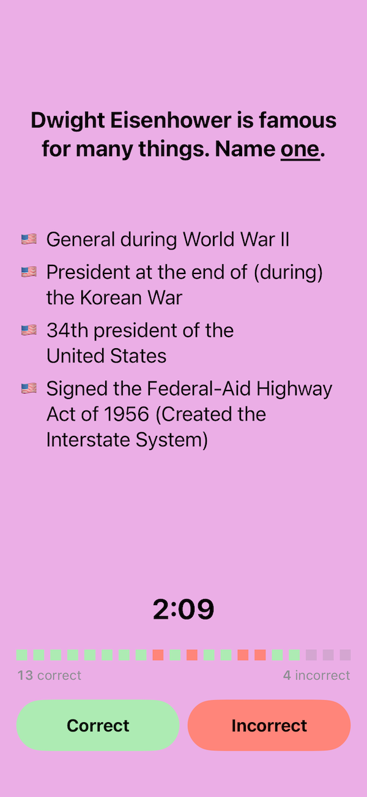

# Civics

A fun little app to help you prepare for your [Civics Test][1]! 🇺🇸🇺🇸

## How to Play

- Tap on **Prep** to study all questions and their answers. 🤓📚
- Tap on **Test** to play! Ask your buddy to play the interviewer and to ask questions out loud.
- Answer correctly at least 12 of the 20 questions in the given time to pass the test. ⏰✅
- Challenge yourself by answering the questions as quickly as possible!

## Resources

- [USCIS 2025 Naturalization Civics Test][1]
- [The USCIS 2025 Civics Test Study Guide][2]
- [128 Civics Questions and Answers (2025 version)][3]

[1]: https://www.uscis.gov/citizenship-resource-center/naturalization-test-and-study-resources/2025-civics-test
[2]: https://www.uscis.gov/sites/default/files/document/brochures/USCIS-2025-Civics-Test-Study-Guide.pdf
[3]: https://www.uscis.gov/sites/default/files/document/questions-and-answers/2025-Civics-Test-128-Questions-and-Answers.pdf
